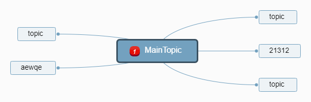

# 我的需求
作为程序员，使用 markdown 语法,便于写以及分发
将记录的零碎知识整理为文章公开发布到内容平台(比如知乎, CSDN, 公众号等). 我需要能一份文章能同步全平台, 而不是每次都要对每个平台做适配
我需要随时随地查阅和回顾自己写的内容

# 次要需求
1. 支持图片，画思维导图，流程图
4. 历史记录
6. 全局检索

# 实现方案

vscode 打造的文章利器 +  分发工具